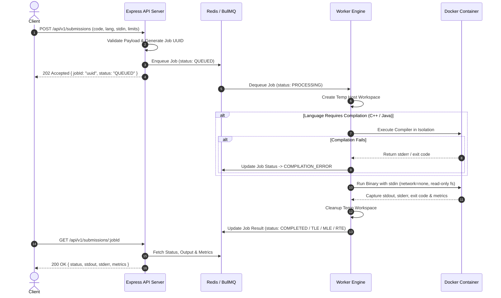
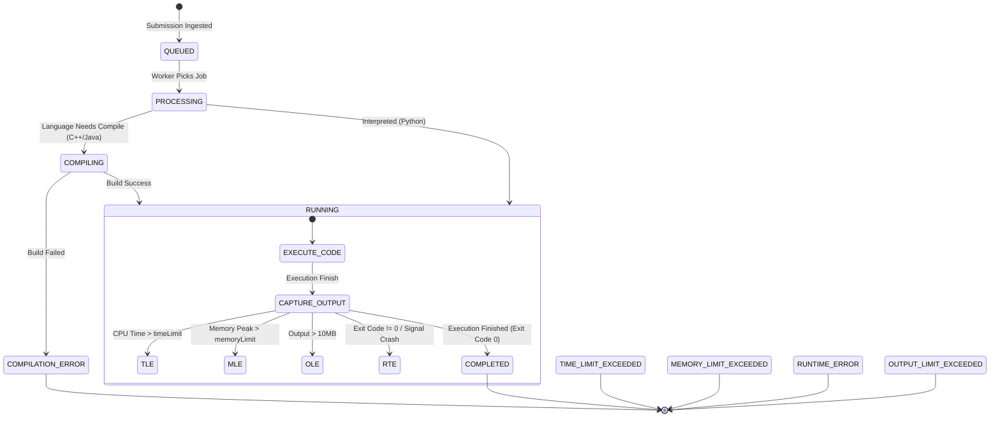

# Product Requirements Document (PRD): Remote Code Execution (RCE) Engine

## 1. Executive Summary
This document defines the architectural specifications, security mandates, and technical requirements for building a highly scalable, secure, and isolated **Remote Code Execution (RCE) Engine**. 

The system accepts untrusted source code from client applications, compiles it (if required) in an isolated sandbox, executes it with provided standard input (`stdin`) under strict resource constraints (CPU, RAM, Processes, I/O), and returns the execution output (`stdout`, `stderr`), execution time, and memory usage directly to the client.

> [!NOTE]
> **Scope Clarification:** Automated test case verification (comparing output to `expectedOutput` to produce `ACCEPTED` or `WRONG_ANSWER` verdicts) is deferred to the **Future Scope** of this project. The current version focuses on secure code execution and raw output streaming to the client.

---

## 2. Core System Objectives & Quality Attributes

*   **Zero-Trust Security & Sandbox Isolation:** Execute untrusted, potentially malicious code without exposing the host operating system, local network, or host filesystem to privilege escalation, container escapes, resource exhaustion, or network-based attacks.
*   **Raw Output & Telemetry Delivery:** Capture standard output (`stdout`), standard error (`stderr`), exit code, CPU time (`executionTimeMs`), and peak RAM (`memoryUsedKb`) for client display.
*   **Resource Accounting & Constraint Enforcement:** Accurately enforce and measure CPU time limits (**Time Limit Exceeded - TLE**) and RAM limits (**Memory Limit Exceeded - MLE**). Distinguish between container boot latency and user-code CPU execution time.
*   **High Concurrency & Asynchronous Architecture:** Handle high-throughput, concurrent code submissions using a non-blocking queue model to decouple the API Gateway from execution workers.
*   **Multi-Language Support:** Provide native execution support for **C++ (g++)**, **Python (python3)**, and **Java (openjdk)**.

---

## 3. Technology Stack & Tooling

| Layer | Component / Tool | Purpose |
| :--- | :--- | :--- |
| **API Gateway** | Node.js, Express.js | Ingestion endpoint, payload validation, job dispatching, status polling. |
| **Queue & Broker** | BullMQ, Redis (v7+) | Asynchronous job queue, state persistence, worker distribution. |
| **Sandbox & Virtualization** | Docker Engine | Lightweight containerized isolation per submission. |
| **Security Controls** | Linux cgroups v2, seccomp, tmpfs | Kernel-level resource limits, syscall filtering, read-only FS. |
| **Language Runtimes** | `g++ 12+`, `python 3.11+`, `openjdk 17` | Language compilation and runtime execution environments. |
| **Telemetry & Metrics** | GNU `time`, Linux `/sys/fs/cgroup` | High-precision CPU and memory measurement. |

---

## 4. System Architecture & Flow



### 4.1. Component Breakdown
1. **Express API Server (Producer):** Receives code submission requests, validates input schemas, verifies boundary limits, generates a unique job UUID v4, pushes job objects into BullMQ, and immediately responds to the client.
2. **Redis In-Memory Data Store:** Stores BullMQ queues, active job locks, and transient submission status results with a configured TTL (e.g., 24 hours).
3. **Worker Node (Consumer):** A dedicated Node.js background process listening to BullMQ. It handles temporary file writing, language-specific workflow orchestration, container spawning via Docker CLI, output parsing, metric extraction, and cleanup.
4. **Isolated Docker Sandbox:** Ephemeral container instances initialized per submission run with read-only root filesystems, dropped Linux capabilities, disabled networking, and strict cgroups limits.

---

## 5. Execution State Machine & Status Lifecycle



### Status Descriptions
* `QUEUED`: Submission accepted by API and awaiting worker pickup in Redis queue.
* `PROCESSING`: Worker has picked up the job and is preparing source files.
* `COMPILING`: Compiler (`g++` or `javac`) is running inside the compilation container.
* `COMPILATION_ERROR`: Code failed to compile. Compiler stderr is captured and returned.
* `COMPLETED`: Code compiled and executed successfully within limits. Raw stdout and stderr are returned.
* `TIME_LIMIT_EXCEEDED (TLE)`: Execution CPU time exceeded specified limit (e.g., > 2000ms).
* `MEMORY_LIMIT_EXCEEDED (MLE)`: Execution peak memory consumption exceeded limit (e.g., > 256MB) or triggered an Out-Of-Memory (OOM) kill.
* `OUTPUT_LIMIT_EXCEEDED (OLE)`: Code attempted to print excessive data (e.g., > 10MB) to standard output.
* `RUNTIME_ERROR (RTE)`: Code crashed due to unhandled exceptions, zero division, segmentation fault, or non-zero exit code.
* `INTERNAL_ERROR`: Infrastructure error (e.g., Docker daemon failure, host disk full).

---

## 6. Security Sandbox & Threat Model Specification

Un-sandboxed code execution exposes the host machine to severe vulnerabilities. The table below details attack vectors and enforced kernel/container mitigations:

| Attack Vector | Vulnerability / Threat | Mitigation Mechanism | Enforced Docker Flag / Parameter |
| :--- | :--- | :--- | :--- |
| **Network Attack** | Botnet participation, SSRF, reverse shell | Complete network isolation | `--network none` |
| **Fork Bomb** | Starve host CPU/PIDs (`while(1) fork();`) | Strict process tree limit | `--pids-limit 64` |
| **Disk Bomb** | Fill host hard drive with huge files | Read-only root filesystem + small tmpfs | `--read-only --tmpfs /tmp:rw,noexec,nosuid,size=64m` |
| **Host FS Escape** | Overwrite host files or access `/etc/passwd` | Run as unprivileged user + no host mounts | `--user 1001:1001` + Stdin code piping |
| **Privilege Escalation** | Exploiting `setuid` binaries or kernel bugs | Drop all capabilities + disable new privileges | `--cap-drop=ALL --security-opt=no-new-privileges` |
| **Memory Bypass** | Exceeding RAM limit via swap space | Enforce equal memory swap cap | `--memory=256m --memory-swap=256m` |
| **Syscall Exploits** | Dangerous syscalls (`ptrace`, `syslog`, `reboot`) | Default or custom Linux seccomp profile | Default seccomp profile enabled |

---

## 7. API Specifications & Data Contracts

### 7.1. Submit Code for Execution
* **Endpoint:** `POST /api/v1/submissions`
* **Content-Type:** `application/json`
* **Request Payload Schema:**
```json
{
  "language": "cpp",
  "sourceCode": "#include <iostream>\nusing namespace std;\nint main() {\n  int a, b;\n  if (cin >> a >> b) cout << \"Sum is: \" << (a + b) << endl;\n  return 0;\n}",
  "stdin": "5 10\n",
  "timeLimitMs": 2000,
  "memoryLimitMb": 256
}
```

* **Validation Rules:**
  * `language`: Enum [`cpp`, `python`, `java`].
  * `sourceCode`: Non-empty string, maximum length **65,536 bytes (64 KB)**.
  * `stdin`: Optional string (input supplied to program stdin), maximum length **65,536 bytes (64 KB)**.
  * `timeLimitMs`: Integer between **100 ms** and **10,000 ms** (default: 2000 ms).
  * `memoryLimitMb`: Integer between **16 MB** and **512 MB** (default: 256 MB).

* **Success Response (`202 Accepted`):**
```json
{
  "success": true,
  "jobId": "f47ac10b-58cc-4372-a567-0e02b2c3d479",
  "status": "QUEUED",
  "queuedAt": "2026-08-25T02:55:00.000Z"
}
```

* **Error Response (`400 Bad Request`):**
```json
{
  "success": false,
  "error": "INVALID_PAYLOAD",
  "details": [
    "language must be one of ['cpp', 'python', 'java']"
  ]
}
```

---

### 7.2. Poll Submission Status & Metrics
* **Endpoint:** `GET /api/v1/submissions/:jobId`
* **Response (`200 OK` - Completed Execution):**
```json
{
  "jobId": "f47ac10b-58cc-4372-a567-0e02b2c3d479",
  "status": "COMPLETED",
  "language": "cpp",
  "stdout": "Sum is: 15\n",
  "stderr": "",
  "exitCode": 0,
  "metrics": {
    "executionTimeMs": 14,
    "memoryUsedKb": 4120
  },
  "completedAt": "2026-08-25T02:55:02.150Z"
}
```

* **Response (`200 OK` - Compilation Error):**
```json
{
  "jobId": "a1b2c3d4-e5f6-7890-abcd-1234567890ab",
  "status": "COMPILATION_ERROR",
  "language": "cpp",
  "stdout": "",
  "stderr": "solution.cpp: In function 'int main()':\nsolution.cpp:4:3: error: 'coutt' was not declared in this scope\n   4 |   coutt << (a + b);\n     |   ^~~~~\n",
  "exitCode": 1,
  "metrics": {
    "executionTimeMs": 0,
    "memoryUsedKb": 0
  },
  "completedAt": "2026-08-25T02:55:01.800Z"
}
```

* **Response (`200 OK` - Runtime Error):**
```json
{
  "jobId": "c9d8e7f6-a5b4-3210-fedc-9876543210fe",
  "status": "RUNTIME_ERROR",
  "language": "python",
  "stdout": "",
  "stderr": "Traceback (most recent call last):\n  File \"solution.py\", line 2, in <module>\n    print(1 / 0)\nZeroDivisionError: division by zero\n",
  "exitCode": 1,
  "metrics": {
    "executionTimeMs": 28,
    "memoryUsedKb": 11450
  },
  "completedAt": "2026-08-25T02:55:02.010Z"
}
```

---

## 8. Resource Accounting & Measurement Rules

1. **Execution Time Measurement:**
   * Pure CPU execution time (User CPU + System CPU time) must be measured, excluding container bootstrap overhead.
   * Inside the container, GNU `/usr/bin/time -f "%e %U %S %M"` is invoked to output wall time (`%e`), user CPU (`%U`), system CPU (`%S`), and peak RSS memory in KB (`%M`).
2. **Memory Accounting & Language Tailoring:**
   * **C++:** Native execution. Baseline memory overhead ~2–4MB.
   * **Python:** CPython interpreter overhead ~10–15MB.
   * **Java:** JVM runtime overhead ~80–120MB. When `memoryLimitMb` is specified for Java, JVM heap flags `-Xmx` (e.g., `-Xmx128m`) must be passed during execution to prevent premature JVM crash before application logic executes.

---

## 9. Non-Functional Requirements & Constraints

* **Rate Limiting:** Maximum 20 requests per minute per IP address on `POST /api/v1/submissions`.
* **Queue Timeout:** Jobs in `QUEUED` state for longer than 60 seconds are automatically failed with status `INTERNAL_ERROR`.
* **Output Truncation:** Standard output per submission is capped at **10,000 characters** to prevent payload inflation.
* **Storage Retention:** Submission results expire from Redis after 24 hours (TTL = 86,400 seconds).

---

## 10. Future Scope & Roadmap

The following features are explicitly out of scope for the initial release and reserved for future iterations:

1. **Automated Output Verification (Verdict Engine):**
   * Support for multiple test case inputs and expected outputs per submission.
   * Verdict generation (`ACCEPTED`, `WRONG_ANSWER`, `PARTIAL_ACCEPTED`).
   * Custom white-space and float-precision diffing routines.
   * Custom Special Judge / Checker binaries for non-deterministic problem outputs.
2. **Pre-Warmed Container Pools:**
   * Transition from cold `docker run` per submission to warm idle container pools for sub-50ms execution latency.
3. **Interactive WebSocket Streaming:**
   * Real-time streaming of stdout/stderr logs over WebSockets for live execution feedback.
